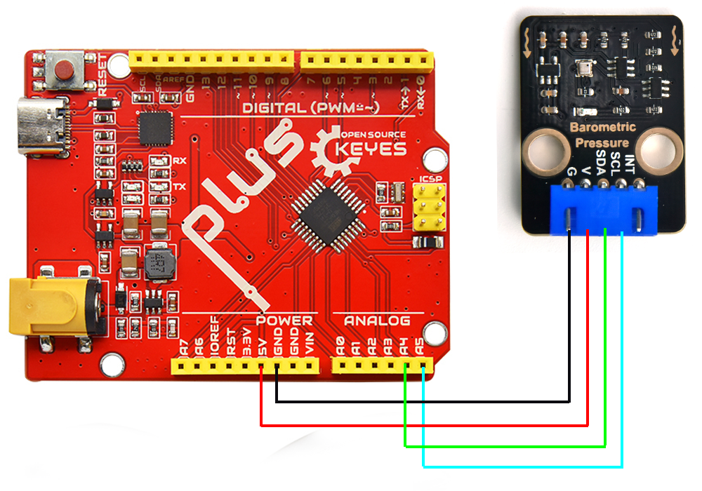
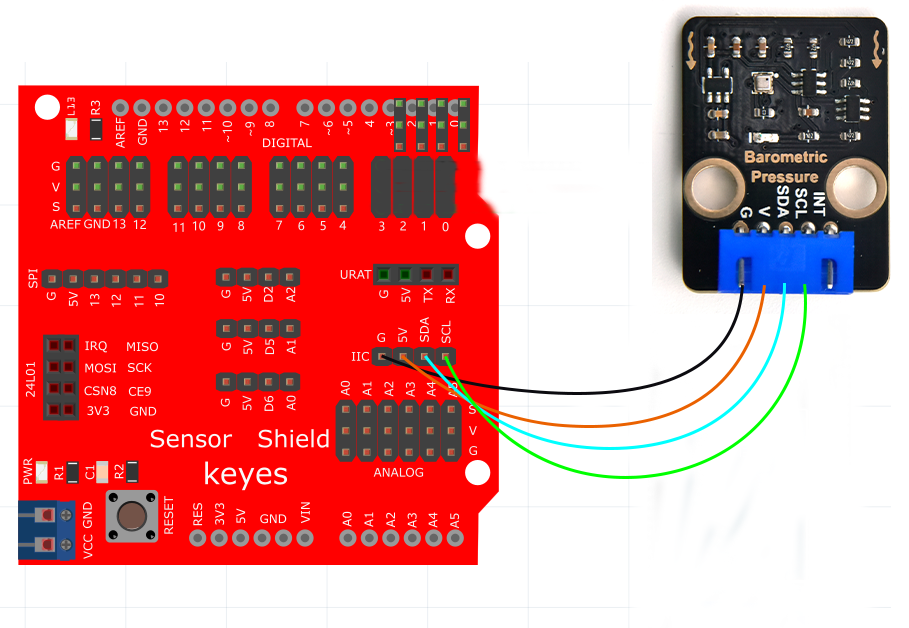
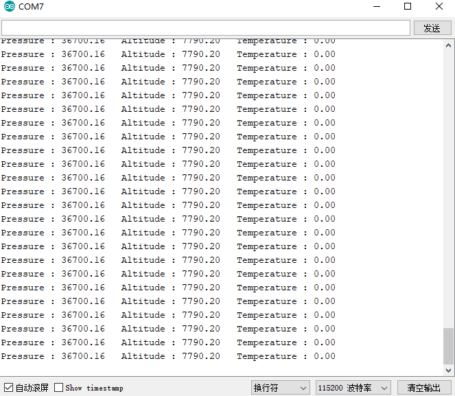

# Arduino


## 1. Arduino简介  

Arduino是一种开源电子原型平台，旨在为开发者和初学者提供一个简单且高效的工具，以创建互动项目。Arduino平台由硬件和软件组成，硬件包括多种开发板，比如Arduino UNO、MEGA和Nano，软件主要是Arduino IDE，用于编写和上传代码到开发板。Arduino支持多种传感器和模块，可以应用于物联网、环境监测、机器人等多个领域。丰富的社区资源和教程使得Arduino非常适合教育和个人创作，是学习电子学和编程的理想选择。  

## 2. 接线图  

接主板  

  

接扩展板  

  

## 3. 测试程序  

```cpp  
#include "Waveshare_BMP388.h"  

void setup() {  
    // put your setup code here, to run once:  
    bool bRet;  
    PRESS_EN_SENSOR_TYPY enPressureType;  

    Serial.begin(115200);  
    pressSensorInit(&enPressureType);  

    if (PRESS_EN_SENSOR_TYPY_BMP388 == enPressureType) {  
        Serial.println("Pressure sensor is BMP388");  
    } else {  
        Serial.println("Pressure sensor NULL");  
    }  

    Serial.println("/-------------------------------------------------------------/");  
    delay(1000);  
}  

void loop() {  
    // put your main code here, to run repeatedly:  
    int32_t s32PressureVal = 0, s32TemperatureVal = 0, s32AltitudeVal = 0;  
    pressSensorDataGet(&s32TemperatureVal, &s32PressureVal, &s32AltitudeVal);  

    Serial.print("Pressure : ");   
    Serial.print((float)s32PressureVal / 100);  
    Serial.print(" Altitude : ");   
    Serial.print((float)s32AltitudeVal / 100);  
    Serial.print(" Temperature : ");   
    Serial.print((float)s32TemperatureVal / 100);  
    Serial.println();  
}  
```  

## 4. 实验结果  

上传代码完成后，接好线，上电，打开串口监视器并设置波特率为115200，我们将能看到该模块测得的大气压、海拔和温度，结果如下：  




