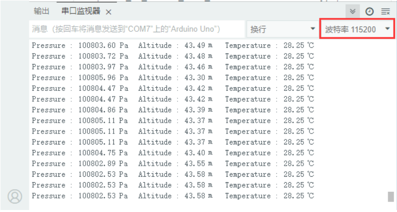

# Arduino 教程


## 1. Arduino简介  

Arduino是一种开源电子原型平台，旨在为开发者和初学者提供一个简单且高效的工具，以创建互动项目。Arduino平台由硬件和软件组成，硬件包括多种开发板，比如Arduino UNO、MEGA和Nano，软件主要是Arduino IDE，用于编写和上传代码到开发板。Arduino支持多种传感器和模块，可以应用于物联网、环境监测、机器人等多个领域。丰富的社区资源和教程使得Arduino非常适合教育和个人创作，是学习电子学和编程的理想选择。 

## 2. Arduino IDE环境配置和驱动安装 


相关链接：[https://www.keyesrobot.cn/projects/Arduino/zh-cn/latest/](https://www.keyesrobot.cn/projects/Arduino/zh-cn/latest/)


## 3. 接线图  

**接主板**  

  

**接扩展板**  

  

## 4. 测试程序  

- <span style="color: rgb(255, 76, 65);">**下载代码**</span>：[Arduino](./Arduino.7z)


**注意：为了避免上传代码不成功，请上传代码前不要连接模块。代码上传成功后，拔下USB线断电，按照接线图正确接好模块后再用USB线连接到计算机上电，观察实验结果。**


```c
/*  
 * 名称   : bmp388 barometric pressure
 * 功能   : bmp388气压传感器检测大气压，海拔和温度
 * 作者   : http://www.keyes-robot.com/ 
*/
#include "Waveshare_BMP388.h"

void setup() {  //把你的设置代码放在这里，只运行一次:
  bool bRet;
  PRESS_EN_SENSOR_TYPY enPressureType;
  Serial.begin(115200);
  pressSensorInit( &enPressureType );
  if(PRESS_EN_SENSOR_TYPY_BMP388 == enPressureType){
    Serial.println("Pressure sersor is BMP388");
  }
  else{
    Serial.println("Pressure sersor NULL");
  }
  Serial.println("/-------------------------------------------------------------/");
  delay(1000);
}

void loop() {  // 把主代码放在这里，反复运行:
  int32_t s32PressureVal = 0, s32TemperatureVal = 0, s32AltitudeVal = 0;
  pressSensorDataGet(&s32TemperatureVal, &s32PressureVal, &s32AltitudeVal);
  Serial.print("Pressure : "); 
  Serial.print((float)s32PressureVal / 100);
  Serial.print(" Pa"); 
  Serial.print("   Altitude : "); 
  Serial.print((float)s32AltitudeVal / 100);
  Serial.print(" m");
  Serial.print("   Temperature : "); 
  Serial.print((float)s32TemperatureVal / 100);
  Serial.print(" ℃");
  Serial.println();
  delay(50);  
}
```

## 5. 实验结果  

上传代码完成后，接好线，上电，打开串口监视器并设置波特率为115200，我们将能看到该模块测得的大气压、海拔和温度，结果如下：  




**特别提醒：** 若代码上传成功后串口监视器不打印数据信息，尝试按一下主控板上的RESET键。