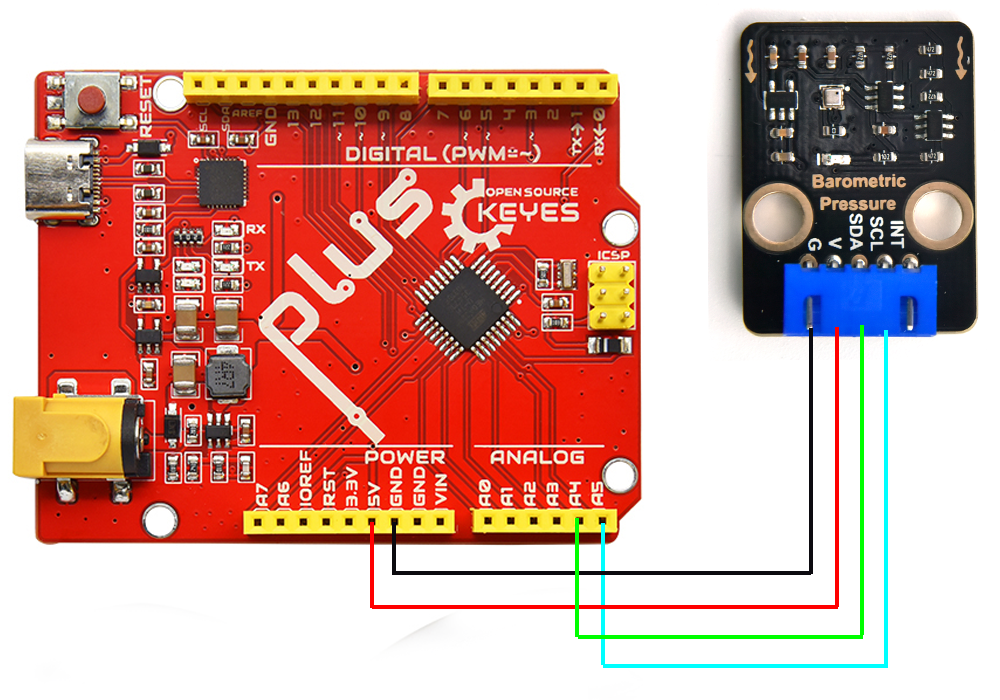
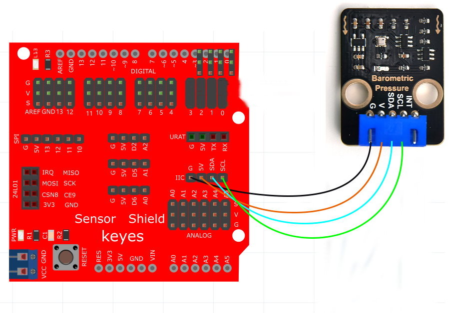
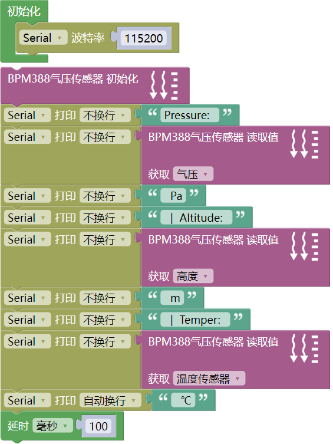
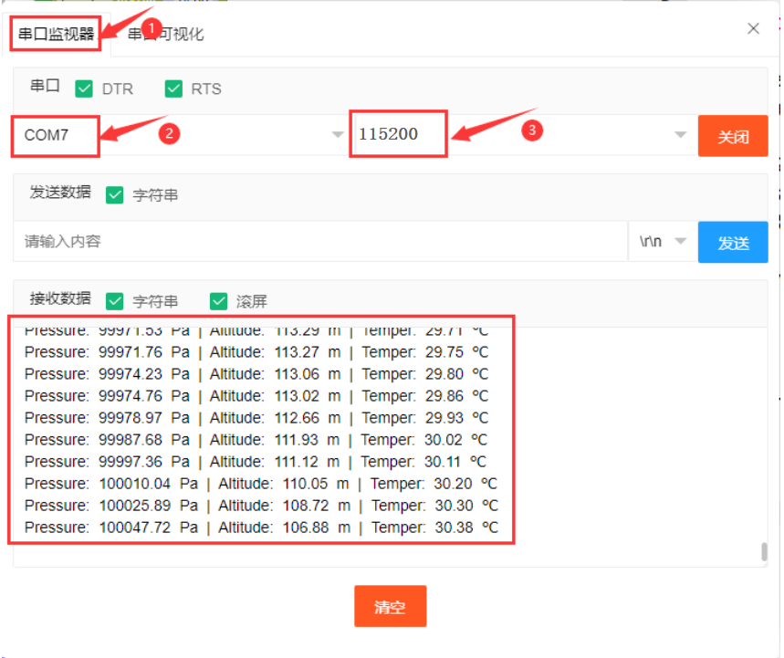

# Mixly 教程

## 1. Mixly IDE开发环境配置 

相关链接：[https://www.keyesrobot.cn/projects/mixly/zh-cn/latest/](https://www.keyesrobot.cn/projects/mixly/zh-cn/latest/)

## 2. 接线图  

**接主板**  

  

**接扩展板** 

  

## 3. 测试程序  

- **下载代码**：[Mixly](./Mixly.7z)

**注意：为了避免上传代码不成功，请上传代码前不要连接模块。代码上传成功后，拔下USB线断电，按照接线图正确接好模块后再用USB线连接到计算机上电，观察实验结果。**

## 4. 实验结果  

上传代码完成后，接好线，上电，打开串口监视器并设置波特率为115200，我们将能看到该模块测得的大气压、海拔和温度，结果如下：  

**特别提醒：** 若代码上传成功后串口监视器不打印数据信息，尝试按一下主控板上的RESET键。

